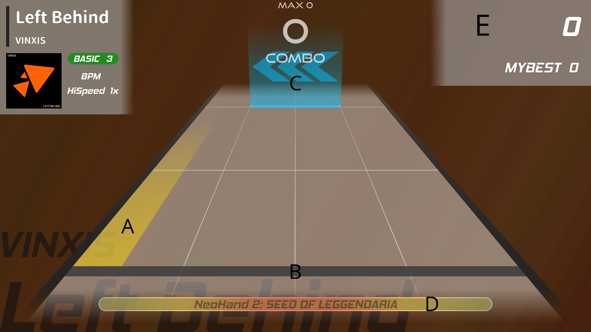
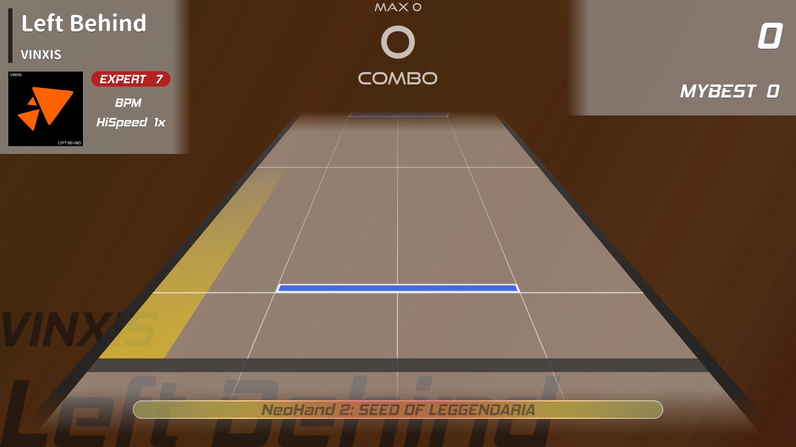
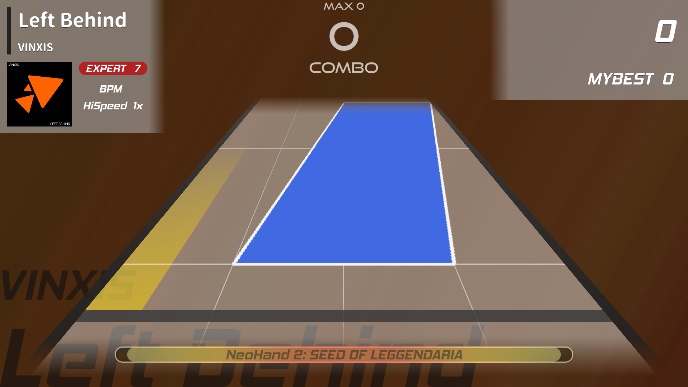
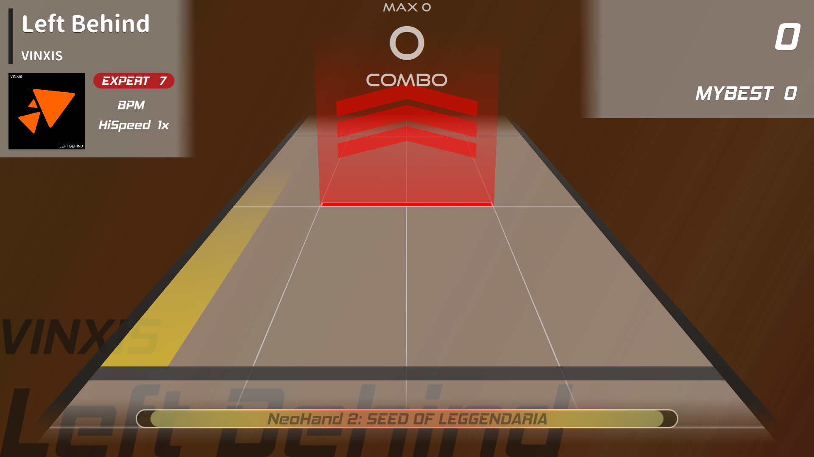
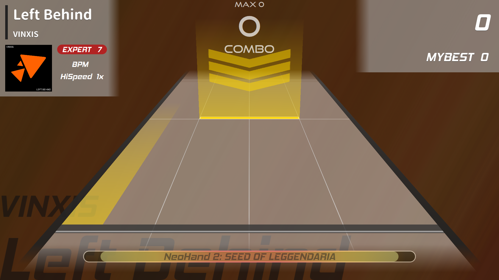
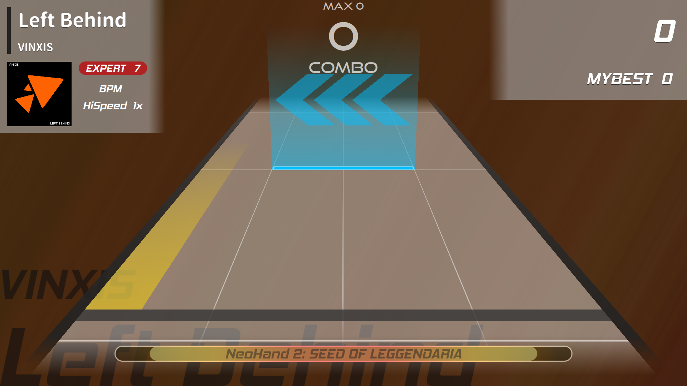
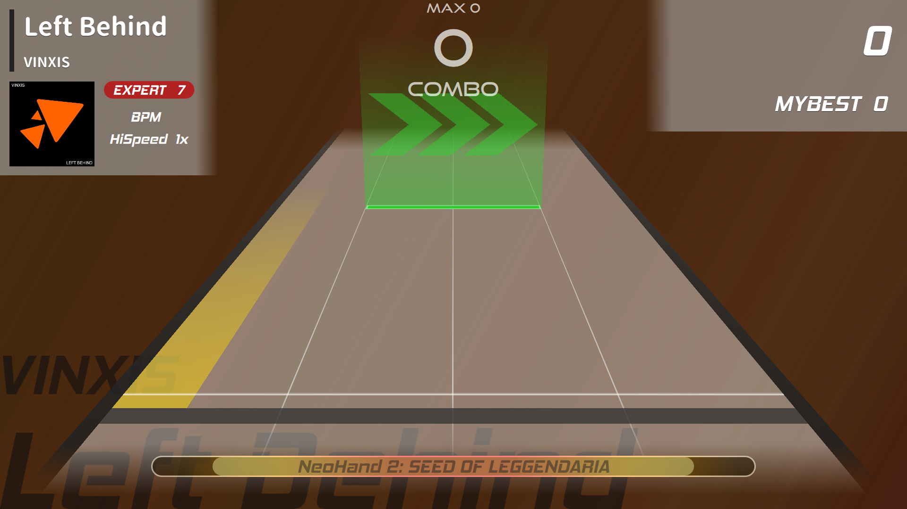

## 遊戲說明
### 遊戲畫面

- A：手的游標位置
- B：判定線
- C：Note（音符）
- D：血條
- E：分數

### Note種類
- click：click note到判定線時，移動游標到note的位置，瞬間將手張開呈5的手勢

- hold：hold note到判定線時，移動游標到note的位置，維持手張開呈5的手勢，並隨著note移動

- swipe：swipe note到判定線時，移動游標到note的位置，將手以指定的方向輕滑
  - up
  
  - down
  
  - left
  
  - right
  
  
### 遊戲目標
- 追求更高的分數，跟隨節奏，直到音樂結束
- 若血條被扣完，遊戲則終止
